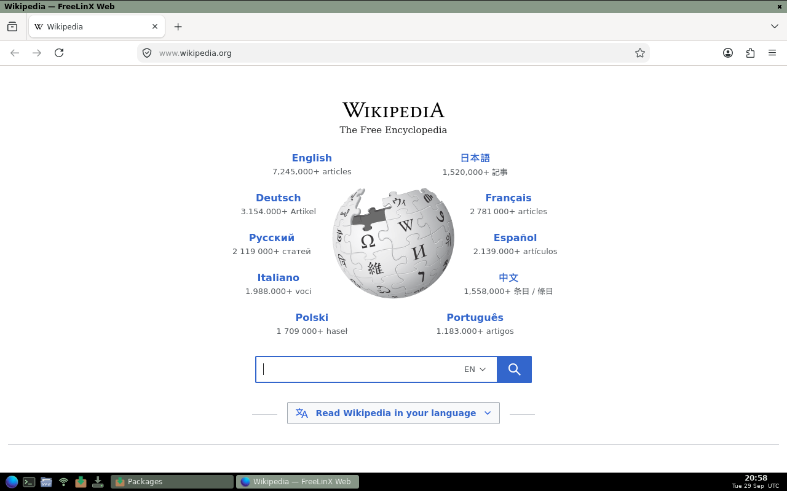
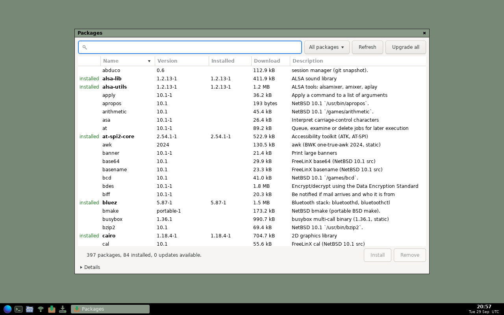
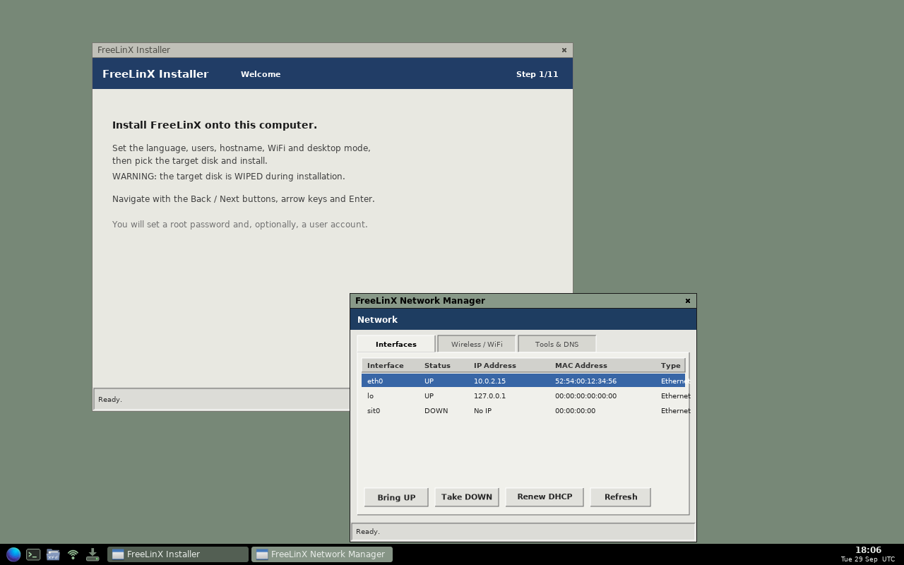
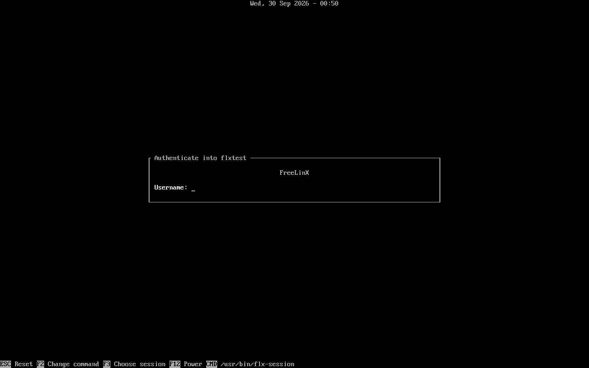

# FreeLinX Desktop 

FreeLinX is an independent Linux distribution with a NetBSD userland, the
musl C library and an LLVM toolchain. **Nothing in it is built by GCC or
linked against glibc** — every image and every package is checked for that
before it is published.

It boots to a light Openbox desktop with a Firefox-based browser, installs to
disk from a graphical installer, and keeps itself up to date with its own
package manager.



## Download

**[FreeLinX 1.0.5 (x86_64 ISO)](https://github.com/FreeLinX/FreeLinX/releases/latest)**
— about 500 MB, BIOS and UEFI, boots from USB or DVD. Check it against
`SHA256SUMS` on the release page.

Write it to a USB stick (this erases the stick):

```sh
dd if=freelinx-1.0.5-x86_64.iso of=/dev/sdX bs=4M conv=fsync status=progress
```

or try it in a virtual machine:

```sh
qemu-system-x86_64 -enable-kvm -m 4096 -cdrom freelinx-1.0.5-x86_64.iso
```

The live system runs from RAM: 2 GB is the minimum, 4 GB is comfortable.

## What you get

- **Openbox desktop**: panel with launchers, window list and clock;
  right-click menu; works on any GPU, with OpenGL acceleration on Intel, AMD
  (radeonsi) and NVIDIA (nouveau), and hardware video decoding (VA-API).
- **FreeLinX Web** (Firefox ESR 153): the full modern web, H.264/AAC video.
  Dillo, Links and w3m as light browsers.
- **Graphical installer**: language, keyboard, time zone, users, WiFi, disk —
  a BIOS + UEFI bootable system in a few minutes.
- **Packages** and `xpkg`: about 400 packages from a signed repository —
  including the desktop itself, so `xpkg upgrade` updates Xorg, Mesa, GTK and
  the browser too.
- **Hardware**: Intel, Qualcomm, Realtek, MediaTek and Broadcom WiFi;
  Bluetooth; Intel SOF / SoundWire laptop audio, HDA and USB audio; NVMe;
  webcams; SD cards; touchpads; USB4/Thunderbolt; game pads.
- Terminal, file manager, PDF viewer, media player, vim, git, and the
  NetBSD command line.

| | |
|---|---|
|  |  |
|  | |

## Under the hood

| Layer | Component |
|---|---|
| Kernel | Linux 6.6 LTS (6.6.157), built with clang/LLD |
| C library | musl 1.2.5 |
| Compiler / C++ runtime | LLVM 21 (clang, LLD, libc++, libunwind) |
| Userland | NetBSD 10.1 tools, NetBSD curses, toybox for the Linux-specific ones |
| Init | runit + mdevd |
| Desktop | Xorg 21.1, Mesa 24.0 + LLVM 18, GTK 3.24, Openbox, tint2 |
| Login | greetd + tuigreet, Linux-PAM |
| Packages | xpkg 1.0: Ed25519-signed indexes, atomic installs, SQLite database |

## Package manager

```sh
xpkg search editor        # find software
doas xpkg install vim     # install it (and what it needs)
doas xpkg upgrade         # update everything
xpkg list -e              # what you installed
```

Details: [docs/PACKAGES.md](docs/PACKAGES.md). The repository is mirrored at
[huggingface.co/datasets/FreeLinX/packages](https://huggingface.co/datasets/FreeLinX/packages).

## Installing

See [docs/INSTALL.md](docs/INSTALL.md).

## Source

FreeLinX is built from these repositories:

| Repository | Contents |
|---|---|
| [FreeLinX-desk](https://github.com/FreeLinX/FreeLinX-desk) | the desktop image: stack build, rootfs, installer, ISO |
| [xpkg](https://github.com/FreeLinX/xpkg) | the package manager and repository tools |
| [ports](https://github.com/FreeLinX/ports) | NetBSD userland and other ports, built with the FreeLinX toolchain |
| [toolchain](https://github.com/FreeLinX/toolchain) | clang/LLD and the musl sysroot |
| [kernel](https://github.com/FreeLinX/kernel) | kernel configuration |
| [src](https://github.com/FreeLinX/src) | base system integration |

How they fit together: [docs/BUILDING.md](docs/BUILDING.md).

## Status

1.0 is the first release. It has been tested in QEMU/KVM end to end (live
boot, install, login, browser, WiFi via a simulated radio, Bluetooth,
packages). Reports from real hardware are very welcome:
[open an issue](https://github.com/FreeLinX/FreeLinX/issues).

Known limitations are listed in the [release notes](RELEASE-NOTES.md).

"Developed by Denis Gulmammadov and Kanan Majidzada"

## License

FreeLinX's own code is under the BSD 2-Clause license ([LICENSE](LICENSE)).
Every package keeps its upstream license.
